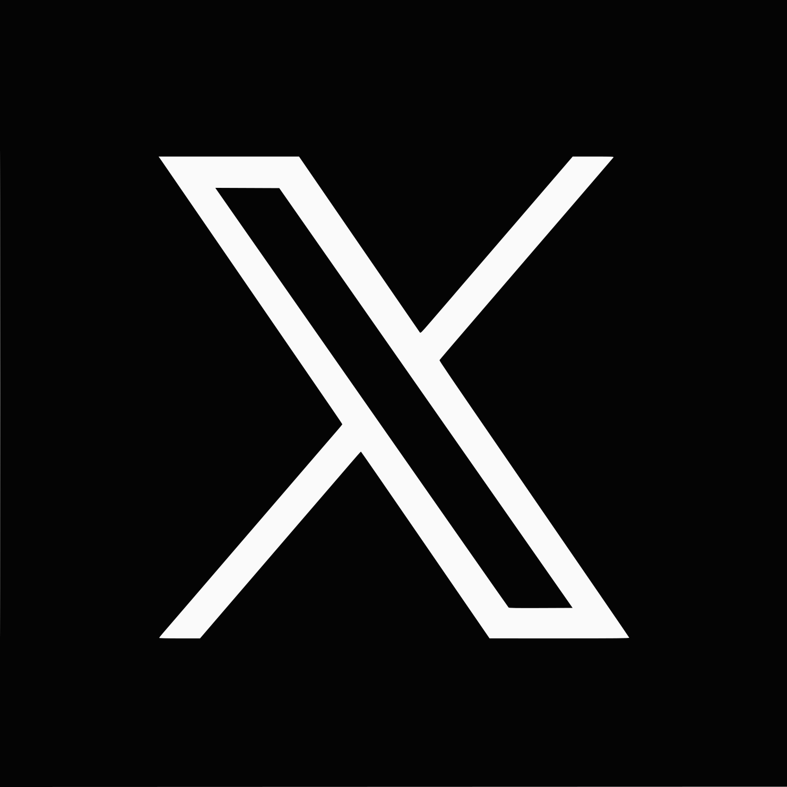
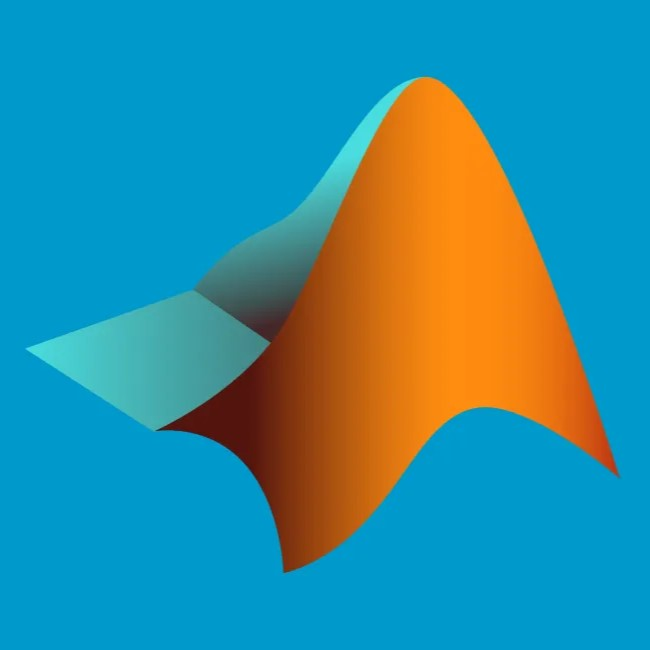

 

<h1 align="center">
  
</h1>

</h5>
 

  ✨ Hi, I'm Hamid Reza Heidari, MSc of Mechatronic Engineering | AI and Robotics Engineer | Teacher
   
   
  🎓 I'm Master's Student of Mechatronics Engineering at AmirKabir University of Technology (Tehran Polytechnic)
   
  🤖 also I'm Manager of Mobile Robotic Laboratory at AUT
   
  👨‍🏫 I'm part-time Computer and Network Teacher
   
  💻 I love writing code and deal with Machines
   
  🔬 My favorite research topics are Robotics & AGVs, Machine-Learning & Industry 4.0
  

 

<h5 align="center">
  
  
  
  
  
  
  

<h2 align="center">💡 Tech Stack 💡</h2>

                                                                                                                                                                                                                                                                                                                                                                                                                                                                                                                                                                                                                                                                                                                                                                                                                                            |
|-------------------------------------------------|-------------------------------------------------------------------------------------------------------------------------------------------------------------------------------------------------------------------------------------------------------------------------------------------------------------------------------------------------------------------------------------------------------------------------------------------------------------------------------------------------------------------------------------------------------------------------------------------------------------------------------------------------------------------------------------------------------------------------------------------------------------------------------------------------------------------------------------------------------------------------------------------------------------------------------------------------------------------------------------------------------------------------------------------------------------------------------------------------------------------------------------------------------------------------------------------------------------------------------------------------------------------------------------------------------------------------------------------------------------------------------------------------------------------------------------------------------------------------------------------------------------------------------------------------------------------------------------------------------------------------------------------------------------------------------------------------------------------------------------------------|
| **Language / IDE**                              |    )    |
| **Machine Learning / Deep Learning ** |         |
| **FrameWorks**                                  |          |
| **Tools & Platform**                            |        |
| **Industry**                                    |        |

<h2 align="center">⚡ Stats ⚡</h2>
 

  

    
    
  

           
  

    
  

   

  

